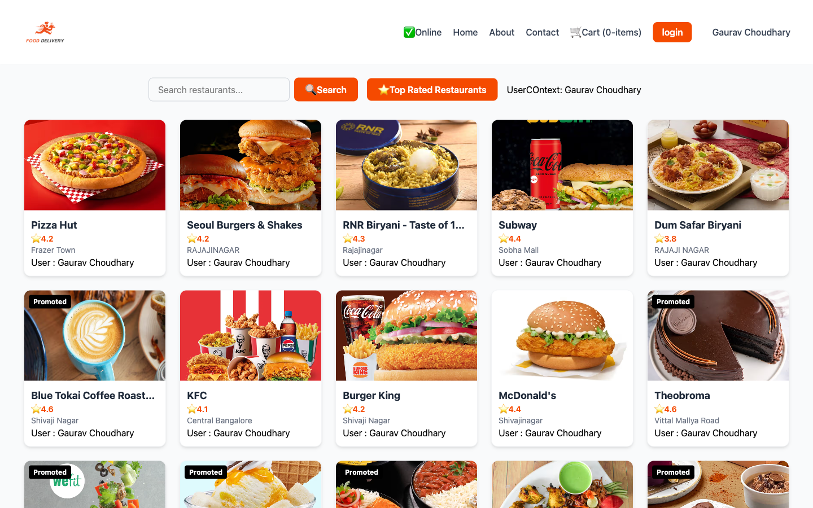

# 🍔 Food Ordering Web App

A full-stack food-ordering application with a **React 19** single-page frontend and a
modular **Node.js / Express** REST backend. Browse restaurants, open live menus,
search and filter, and manage a cart with real-time quantity updates.

---

## ✨ Features

- **Restaurant listing** with a shimmer UI while data loads
- **Live search** and a **Top Rated** filter on the home page
- **Dynamic restaurant menu** pages with collapsible category accordions
- **Cart management** — add / remove items, automatic quantity aggregation, and clear cart
- **Promoted-restaurant badges** rendered via a Higher-Order Component
- **Online / offline detection** with a user-facing network status message
- **Lazy-loaded routes** with React Suspense for faster initial load
- Fully **responsive UI** built with Tailwind CSS

---

## 🛠 Tech Stack

**Frontend:** React 19 · Redux Toolkit · React Redux · React Router v6 · Context API · Tailwind CSS · Parcel

**Backend:** Node.js · Express · CORS · Morgan · dotenv

---

## 🧩 Architecture

```
Project/
├── src/                          # React frontend
│   ├── components/               # UI components (Header, Body, ResMenu, Carts, ...)
│   ├── utils/                    # custom hooks, Redux store & slice, Context, constants
│   └── App.js                    # routes, layout, providers
│
├── backend/                      # Express REST API
│   ├── routes/                   # express routers
│   ├── controllers/              # request / response handling
│   ├── services/                 # data access + business logic
│   ├── middleware/               # notFound, errorHandler
│   ├── utils/                    # readJson, asyncHandler, ApiError, paths
│   ├── data/                     # mock restaurant JSON responses
│   ├── app.js                    # express app wiring
│   └── server.js                 # entry point
│
├── index.html
├── tailwind.config.js
└── package.json
```

**Frontend patterns used:** custom hooks (`useRestaurantList`, `useResturentInfo`,
`useInternetStatus`), Redux Toolkit slice for cart state, Context API for shared user
state, a Higher-Order Component (`withPromotedLabel`), and lazy loading with `React.Suspense`.

---

## 🚀 Getting Started

> The frontend fetches data from the backend, so **start the backend first**.

### 1. Backend (port 5000)

```bash
cd backend
npm install
npm run dev
```

### 2. Frontend

```bash
npm install
npm start
```

Then open the URL Parcel prints in the terminal (default `http://localhost:1234`).

---

## 📡 API Endpoints

| Method | Endpoint                         | Description                                   |
|--------|----------------------------------|-----------------------------------------------|
| GET    | `/api/health`                    | Health check                                  |
| GET    | `/api/restaurants`               | Restaurant list (home page data)              |
| GET    | `/api/restaurants/:restaurantId` | Full restaurant details + menu                |
| GET    | `/api/search?q=pizza`            | Search by name, cuisine, area, or city        |
| GET    | `/api/categories`                | Category grid                                 |
| GET    | `/api/offers`                    | Aggregated offers                             |

---

## 📸 Screenshots

**Home page — restaurant listing, search, and Top Rated filter**



---

## 👤 Author

**Gaurav Choudhary**
